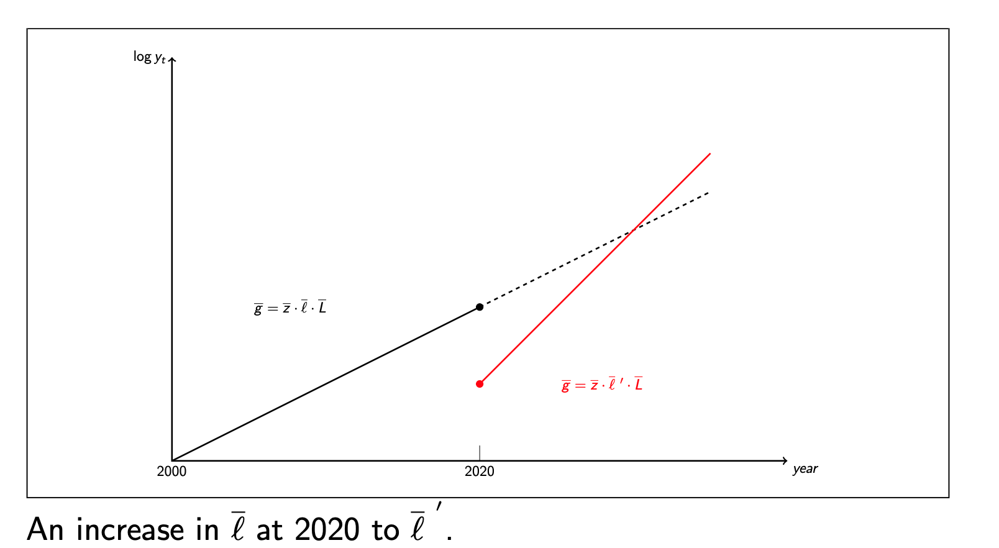

# Week 3

## Intuition:

We are allowing $A$, technology, to be endogenous. 

### Division of economic goods:

- Objects: Physical goods that are finite and rival, limited by the raw materials available. 
- Ideas: Instructions to organize raw materials that are non-rival and infinite. **Sustained economic growth occurs from the discovery of new ideas.**

Note: Existing ideas are non-rival but can be excludable in the form of patents. 

### Ideas lead to increasing returns to scale in production: 

#### How? 
Let the production function be $Y = AX$, where $X$ is labour and capital bundled together. When we double both $A$ and $X$, output quadruples. 

#### Problems with Perfect Competition: 
- In perfect competition, **Price = Marginal Cost**
- Invention of new ideas requires a fixed cost, so under perfectly competitive conditions, no firms would be willing to invest in R & D. 
- To compensate inventors, firms will earn monopoly profits, where **Price > Marginal Cost**. 

## Romer Growth Model

### Production of goods:
$$Y_t = A_tL_{yt}$$
 
- Capital stock ($K$) is fixed at $K = 1$. 
- For a given $A_t$, there's constant return to labour and increasing returns to ideas *and* labour. 
- $L_{yt}$: The amount of labour used in production of goods.

### Production of new ideas:

$$\delta A_{t + 1} = \bar zA_tL_{at} = \bar z \bar l \bar L A_t$$

- $A_t$: The stock of existing ideas. 
- $L_{at}$: The amount of labour used in technology. 
- $\bar z$: Exogenous productivity parameter. 
- Growth rate = $\bar z \bar l \bar L $

***Note***: Ideas are non-rival between the sectors. 

### Labour in the Romer Model:
$$L = L_{at} + L_{yt}$$

$$L_{at} = \bar l \bar L$$ 

- Labour is rival between two sectors. 
- $0 \le \bar l \le 1$ is an exogenous parameter that determines the proportion of labour used in technology. 

## Solving the Romer Model

### Output per capita:
$$y_t = Y_t/L_t = A_t(1 - \bar l)$$
Output per capita depends on the total stock of ideas. 

### Growth rate of knowledge: 

$$\frac{\delta A_{t+1}}{A_t} = \bar z L_{at} = \bar z \bar l \bar L$$

### Output per capita growth: 
Assuming that the stock of knowledge at any time is given by 

$$A_t = A_0(1 + \bar g)^t$$

where $\bar g = \bar z \bar l \bar L$

Then output per capita would be given by 

$$y_t = A_0(1 + \bar g)^t (1 - \bar l) = (1 + \bar g)^t y_0$$

- Output per capita grows at a constant rate and depends upon how much labour supply there is, the amount of labour in the technology sector and the productivity of labour. 

### Experiments on exogenous variables: 
$$y_t = Y_t/L_t = A_0(1 + \bar g)^t (1 - \bar l)$$
$$\bar g = \bar z \bar l \bar L$$

1. **Increase on the population**: 

An increase in $\bar L$ at time $t$ will increase the growth rate for the future path of output, since $\frac{d\bar g}{d \bar L} = \bar z \bar l > 0$.

This is **not a good model on a country by country** basis because it predicts that countries with larger populations will have higher growth rates, which is not true empirically. 

2. **Increase on the share of labour force in technology sector**:
- A growth effect on $\bar g$ which increases growth rate raises the path of future output.
- A level effect on $y_t$ which lowers current and near future levels of output since labour is taken away from the production of goods. 

## Growth Accounting

The general production function is given by
$$Y_t = A_t \times K_t^{1/3}\times L_t^{2/3}$$

The growth rate of output is
$$g_{Yt} = g_{A_t} + (\frac{1}{3})g_{K_t} + (\frac{2}{3})g_{L_t}$$

Let $g_{L_t}$ be the growth rate of the total hour worked in the economy, the per-capita growth rate of output would be: 

$$g_{Yt} -  g_{L_t} = g_{A_t} + (\frac{1}{3})(g_{K_t} - g_{L_t})+ (\frac{2}{3})(g_{L_t} - g_{L_t})$$

The growth rate of output per unit of labour comprises: 
- TFP
- Growth rate of capital per hour worked
- Labour composition/quality of labour

